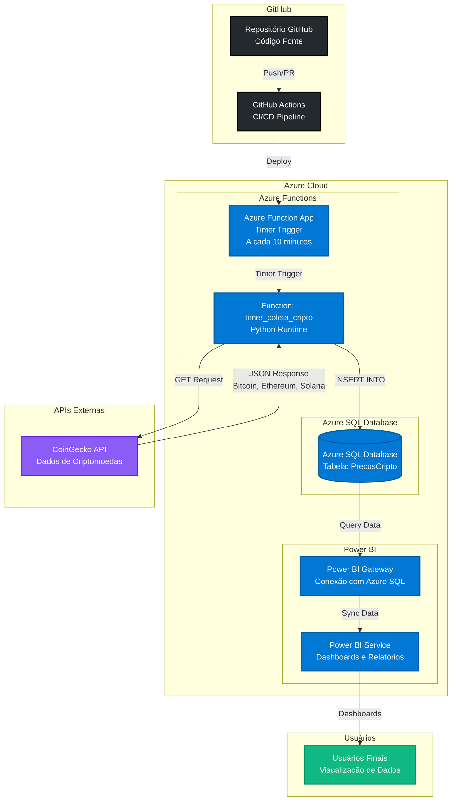
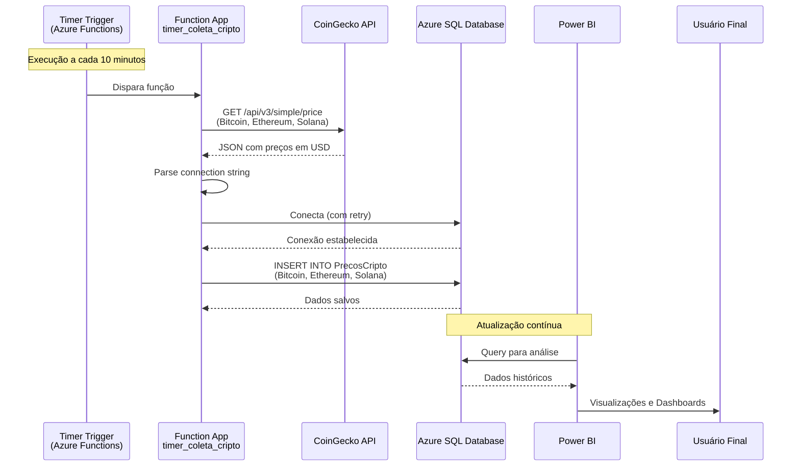

# Arquitetura do Projeto - Coleta de Dados de Criptomoedas

## Visão Geral

Este projeto implementa uma solução serverless para coleta automática de dados de criptomoedas, armazenamento em banco de dados gerenciado e visualização em dashboards analíticos.

## Diagrama de Arquitetura (Mermaid)



## Diagrama de Fluxo de Dados Detalhado



## Componentes da Arquitetura

### 1. GitHub Repository

- **Função**: Controle de versão e armazenamento do código-fonte
- **Tecnologias**: Git, GitHub
- **Arquivos principais**:
  - `function_app.py`: Código principal da Azure Function
  - `requirements.txt`: Dependências Python
  - `host.json`: Configurações do host Azure Functions
  - `Dockerfile`: Containerização (se aplicável)

### 2. GitHub Actions (CI/CD)

- **Função**: Pipeline de integração e deploy contínuo
- **Fluxo**:
  1. Trigger: Push para branch principal ou Pull Request
  2. Build: Validação e testes do código
  3. Deploy: Publicação automática para Azure Functions
- **Benefícios**:
  - Deploy automatizado
  - Validação antes do deploy
  - Histórico de versões

### 3. Azure Functions

- **Função**: Execução serverless do código de coleta
- **Tipo**: Timer Trigger (execução agendada)
- **Frequência**: A cada 10 minutos (`0 */10 * * * *`)
- **Runtime**: Python
- **Características**:
  - Execução automática sem intervenção manual
  - Escalabilidade automática
  - Pay-per-use (custo baseado em execuções)
  - Retry logic para erros transitórios

### 4. CoinGecko API

- **Função**: Fonte de dados de preços de criptomoedas
- **Endpoint**: `/api/v3/simple/price`
- **Moedas coletadas**:
  - Bitcoin (BTC)
  - Ethereum (ETH)
  - Solana (SOL)
- **Formato**: JSON com preços em USD

### 5. Azure SQL Database

- **Função**: Armazenamento persistente dos dados coletados
- **Tabela**: `PrecosCripto`
- **Estrutura** (inferida):
  - `nome_ativo`: Nome da criptomoeda (ex: "Bitcoin")
  - `simbolo`: Símbolo (ex: "BTC")
  - `preco_usd`: Preço em dólares americanos
  - `data_hora`: Timestamp da coleta
- **Características**:
  - Banco de dados gerenciado
  - Backup automático
  - Alta disponibilidade
  - Firewall configurável

### 6. Power BI

- **Função**: Visualização e análise dos dados
- **Componentes**:
  - **Power BI Gateway**: Conecta Power BI ao Azure SQL Database
  - **Power BI Service**: Serviço cloud para dashboards
  - **Relatórios**: Visualizações interativas
- **Capacidades**:
  - Dashboards em tempo real
  - Análises históricas
  - Compartilhamento com usuários
  - Alertas e notificações

## Fluxo de Dados

### 1. Coleta de Dados (Automática)

```
Timer Trigger (10 min) → Azure Function → CoinGecko API → Processamento → Azure SQL Database
```

### 2. Visualização (Contínua)

```
Azure SQL Database → Power BI Gateway → Power BI Service → Dashboards → Usuários
```

### 3. CI/CD (Sob Demanda)

```
GitHub Push → GitHub Actions → Build & Test → Deploy → Azure Functions
```

## Segurança

- **Azure Functions**: Managed Identity para autenticação
- **Azure SQL**: Connection string armazenada em variáveis de ambiente
- **Firewall**: Azure SQL configurado para aceitar conexões do Azure Services
- **Power BI**: Autenticação via Azure AD

## Monitoramento

- **Azure Functions**: Logs e métricas no Application Insights
- **Azure SQL**: Métricas de performance e uso
- **Power BI**: Uso e performance dos relatórios

## Custos

- **Azure Functions**: Pay-per-execution (muito baixo para execuções periódicas)
- **Azure SQL Database**: Baseado no tier escolhido (Basic/Standard/Premium)
- **Power BI**: Licenças por usuário ou capacidade dedicada
- **GitHub Actions**: Minutos gratuitos mensais

## Escalabilidade

- **Azure Functions**: Escala automaticamente conforme demanda
- **Azure SQL**: Pode escalar verticalmente (tier) ou horizontalmente (read replicas)
- **Power BI**: Suporta milhões de linhas e atualizações frequentes

## Próximos Passos Sugeridos

1. Implementar GitHub Actions workflow para CI/CD
2. Adicionar Application Insights para monitoramento detalhado
3. Configurar alertas no Azure Functions
4. Criar dashboards no Power BI
5. Implementar tratamento de erros mais robusto
6. Adicionar testes unitários e de integração
