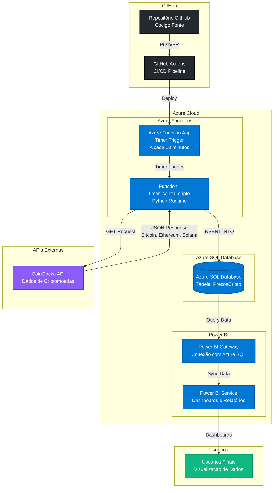
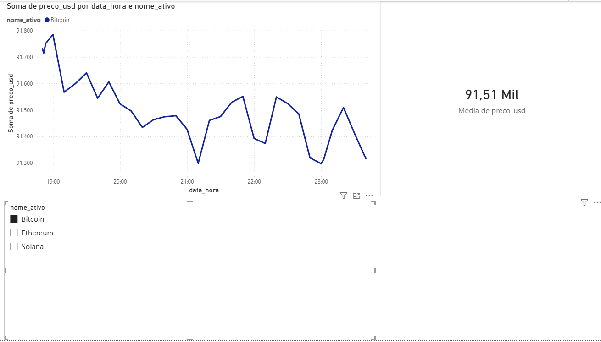

# Sistema de Análise de Dados de Criptomoedas

## Equipe

Luiz Fernando Rodrigues — 18218800 — luizfernando1904@gmail.com

## Descrição Geral

Sistema de análise e monitoramento de preços de criptomoedas em tempo real, desenvolvido com arquitetura serverless na nuvem Azure. O sistema realiza coleta automática de dados de criptomoedas (Bitcoin, Ethereum e Solana) através de API externa, armazena os dados históricos em banco de dados gerenciado e disponibiliza análises visuais através de dashboards interativos no Power BI.

**Problema analisado**: Necessidade de monitoramento contínuo e análise histórica de preços de criptomoedas para tomada de decisões de investimento e análise de tendências de mercado.

**Objetivos do sistema**:

- Coleta automática de preços de criptomoedas a cada 10 minutos
- Armazenamento persistente de dados históricos
- Visualização e análise através de dashboards interativos
- Deploy automatizado via CI/CD
- Arquitetura escalável e serverless

## Dataset

**Fonte dos dados**: [CoinGecko API](https://www.coingecko.com/en/api)

**Endpoint utilizado**: `https://api.coingecko.com/api/v3/simple/price?ids=bitcoin,ethereum,solana&vs_currencies=usd`

**Volume de dados esperado**:

- Coleta: 3 registros a cada 10 minutos
- Volume diário: ~432 registros/dia
- Volume mensal: ~12.960 registros/mês
- Volume anual: ~155.520 registros/ano

**Criptomoedas monitoradas**:

- Bitcoin (BTC)
- Ethereum (ETH)
- Solana (SOL)

**Licenciamento do dataset**:

- CoinGecko API oferece plano gratuito com limite de requisições
- Para uso comercial, é necessário verificar os termos de uso da API
- Dados coletados são armazenados localmente no Azure SQL Database

## Arquitetura da Solução

### Componentes Principais

1. **GitHub Repository**: Controle de versão e armazenamento do código-fonte
2. **GitHub Actions**: Pipeline de CI/CD para deploy automático
3. **Azure Functions**: Execução serverless com timer trigger (a cada 10 minutos)
4. **CoinGecko API**: Fonte de dados de preços de criptomoedas
5. **Azure SQL Database**: Armazenamento persistente dos dados coletados
6. **Power BI**: Visualização e análise através de dashboards interativos

### Fluxo de Dados

1. **Coleta Automática**: Timer Trigger → Azure Function → CoinGecko API → Azure SQL Database
2. **Visualização**: Azure SQL Database → Power BI Gateway → Power BI Service → Dashboards
3. **CI/CD**: GitHub Push → GitHub Actions → Build & Deploy → Azure Functions

## Demonstração

### Capturas de Tela do Dashboard

_Dashboard Power BI com visualizações de preços de criptomoedas (Bitcoin, Ethereum e Solana)_

_Visualização detalhada do dashboard com análises e métricas das criptomoedas_

### Link para Vídeo de Demo

- [ ] YouTube, Stream ou outra plataforma de vídeo
- [ ] Demonstração do funcionamento do sistema
- [ ] Navegação pelos dashboards

## Referências

### APIs e Documentação

- [CoinGecko API Documentation](https://www.coingecko.com/en/api/documentation)
- [Azure Functions Python Developer Guide](https://learn.microsoft.com/en-us/azure/azure-functions/functions-reference-python)
- [Azure SQL Database Documentation](https://learn.microsoft.com/en-us/azure/azure-sql/database/)
- [Power BI Documentation](https://learn.microsoft.com/en-us/power-bi/)

### Ferramentas e Tecnologias

- [GitHub Actions Documentation](https://docs.github.com/en/actions)
- [Azure Functions Timer Trigger](https://learn.microsoft.com/en-us/azure/azure-functions/functions-bindings-timer)
- [pymssql Documentation](https://pymssql.readthedocs.io/)

### Artigos e Tutoriais

- [Azure Functions Python Quickstart](https://learn.microsoft.com/en-us/azure/azure-functions/create-first-function-vs-code-python)
- [Deploy Azure Functions with GitHub Actions](https://learn.microsoft.com/en-us/azure/azure-functions/functions-how-to-github-actions)
- [Connect Power BI to Azure SQL Database](https://learn.microsoft.com/en-us/power-bi/connect-data/service-azure-sql-database-with-direct-connect)
